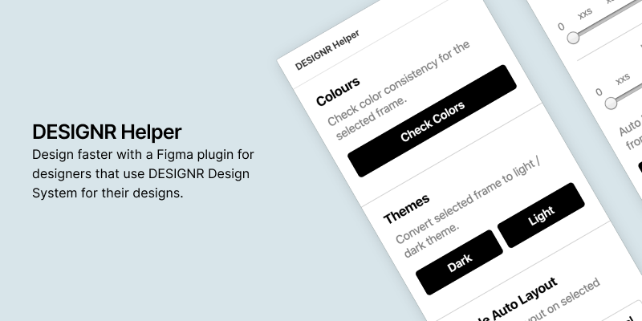
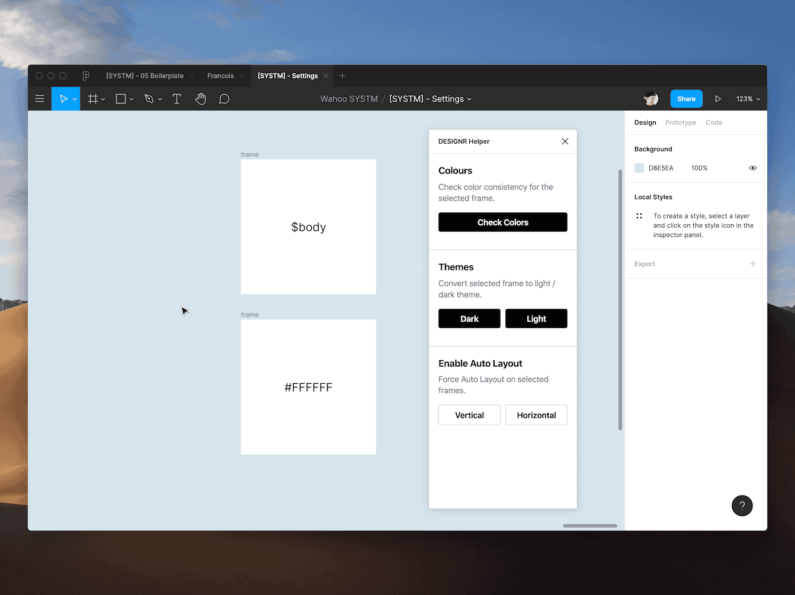
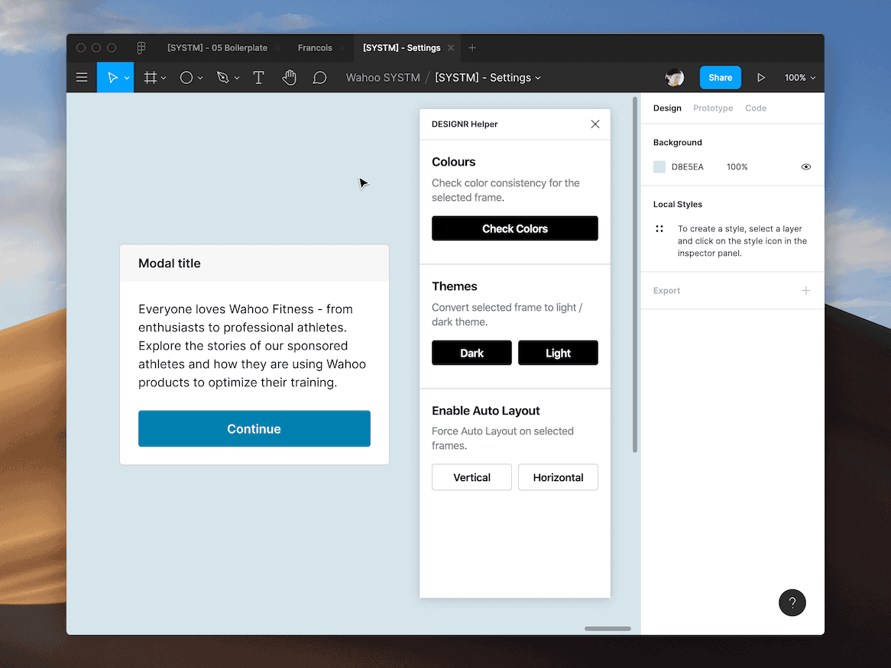
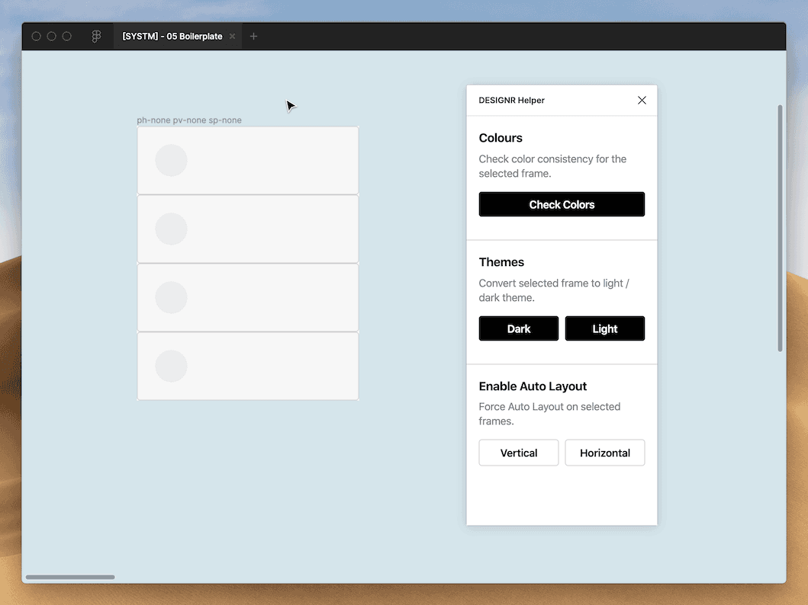

## DESIGNR Figma Plugin

This is a figma plugin that helps us achieve consistent color & spacing for Wahoo SYSTM.

# 🎁 Installation

1. Go to [latest release](https://github.com/aboutjax/designr-figma-plugin/releases/latest) and download the source code.
2. Right click anywhere in Figma canvas → Plugins → Manage Plugins
3. At the right side of the screen, tap "+ Create your own plugin".
4. Tap "Link existing plugin" and choose the `manifest.json` file inside the folder you unzipped.
5. Open the plugin by these two methods:
   - right clicking anywhere on canvas → Plugins → Development → Designr Helper.
   - `cmd + /` to open Figma menu and search "helper".

# 🚀 Features

## Check Colors

**What?** Checks all the colours in the selected frame that aren't using the intended functional colors defined from our design library.

**Why?** Because it's okay to design quickly with the color picker (we're all guity of this, don't lie). But this tool should help us clean up the mess afterwards.

## Convert to Dark / Light Theme

**What?** One click function to convert the entire frame to Dark / Light theme function colours

**Why?** Because doing it one by one under the native Figma "Selection Color" is laborious.

## Auto Layout Spacings

Adjust auto layout spacings with spacing defined from our tokens. Visible when you have a Frame with Auto Layout enabled selected.

**What?** A shortcut for applying spacing values in the Auto Layout properties.

**Why?** Gets us thinking in sizes (ie. S, M, L ) instead of pixel values (ie. 16px, 24px, 32px)

**Note** There’s a weird Figma glitch: After you change a slider value, your cursor needs to go back to Figma canvas to update the frame to the most up to date value. Not sure why, it’s a weird Figma plugin issue I couldn’t fix.

# 💬 To Contribute

If you want to contribute, run this plugin locally on your machine and watch for code changes.

1. `npm install` to install all the dependencies
2. `npx webpack` to watch the `./src` folder and compile any code changes.
3. To see the changes after each compile, bring the Figma desktop app to the foreground, and use `command + option + p` shortcut which tells Figma to re-run the last plugin.
